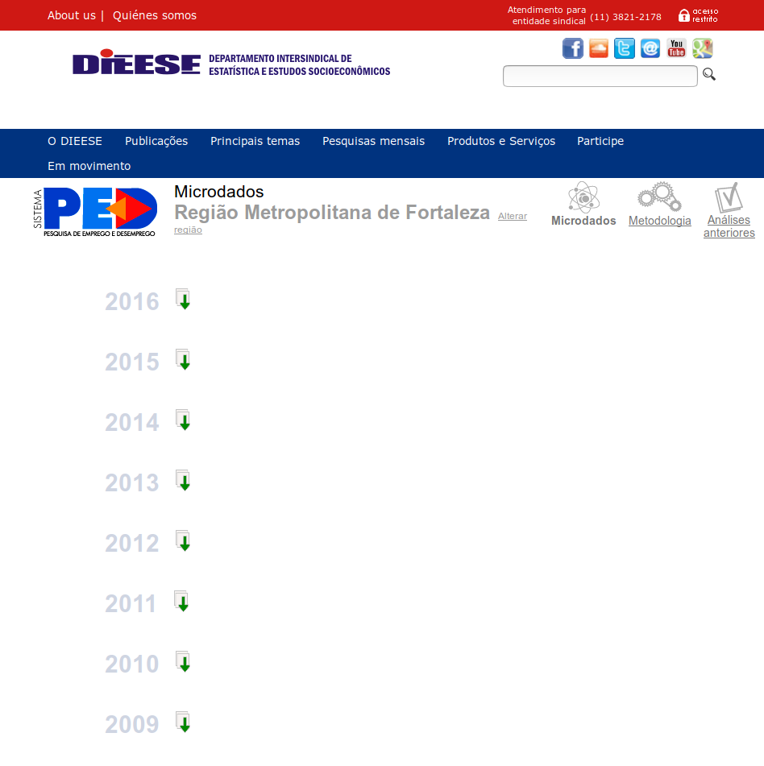
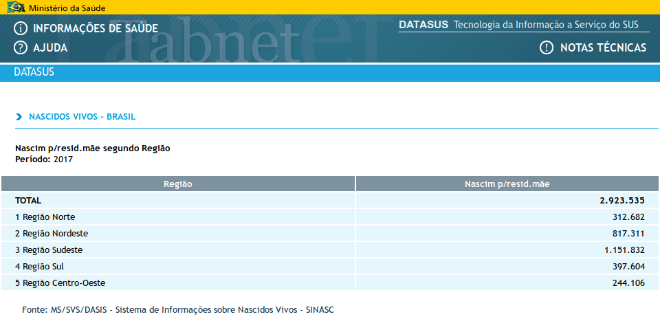
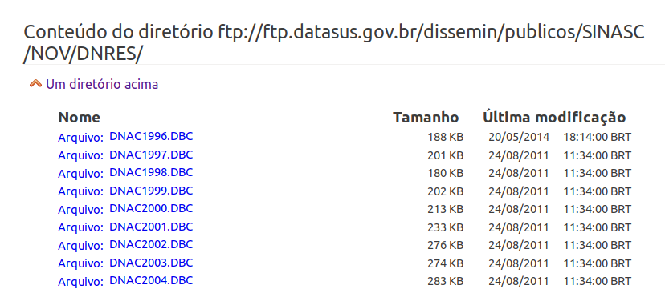

```{r setup, include=FALSE}
# define parâmetros do documento
knitr::opts_chunk$set( echo = TRUE , eval = TRUE , message=FALSE, warning=FALSE , out.width = '100%' , fig.height = 6 , fig.align = "center" , R.options = list( max.print = 10 ) , cache = FALSE )

# define opções
options( useBytes = TRUE )
```

# Coisas que precisamos saber

## O que é *web scraping*?

- É uma técnica de extração de dados de sites.
- Basicamente, um programa coleta de um site as informações que você precisa.
- No nosso caso, arquivos de *microdados*.
    - *Data-scraping!*
- [*Microdados*](https://en.wikipedia.org/wiki/Microdata_(statistics)) são os dados em nível mínimo de agregação. Por exemplo:
    - No caso da PNADC, pessoas entrevistadas.
    - No caso do SIM/SINASC, declarações de nascimento.

## `FTP` vs. `HTML`

`FTP`:

- *File Transfer Protocol*.
- Protocolo de conexão que permite a troca de arquivos entre dois computadores conectados a uma rede.
- Relação cliente-servidor.
    - O cliente solicita a conexão para ter acesso aos arquivos/diretórios, que ficam no servidor.

Exemplos:

- `ftp://ftp.ibge.gov.br/`
<!-- - `ftp://ftp.mtps.gov.br` -->
- `ftp://ftp.datasus.gov.br/`

## `FTP` vs. `HTML`

`HTML`:

- *Hypertext Markup Language*.
- Linguagem base da internet.
- Arquivos de código que são lidos pelo navegador.

Exemplos:

- praticamente todos os sites.
- `https://www.dieese.org.br/`

## *Libraries* para coleta de dados

As principais libraries que usaremos para coletar dados são:

- `rvest`
    - `html`: coleta código-fonte da página.
    - `html_node`: filtra partes do `HTML` através de *XPaths* ou *seletores CSS*.
    - `html_attrs`: coleta lista de atributos específicos do `HTML`.
    - `html_text`: coleta texto do `HTML`.
    - `%>%`: operador *pipe*, usado para levar o resultado de uma função adiante.

## *Libraries* para coleta de dados

As principais libraries que usaremos para coletar dados são:

- `RCurl`:
    - `getURL`: coleta código fonte da página.
        - serve para `FTP` também e inclui outros parâmetros interessantes.
    - `curlPercentEncode`: codifica texto em formato padrão de `url`.

# *Data scraping* em `HTML` | Pesquisa de Emprego e Desemprego

## PED/DIEESE

O que é a Pesquisa de Emprego e Desemprego?

- Conduzida pelo Departamento Intersindical de Estatísticas e Estudos Socioeconômicos (DIEESE)
- Amostral
- Domicílios
- Periodicidade mensal
- [Mais informações aqui.](https://www.dieese.org.br/analiseped/sistemaPed.pdf)

Vejamos esta página:

- https://www.dieese.org.br/analiseped/microdadosFOR.html
- Dados da PED/DIEESE para a região metropolitana de Fortaleza.

## Página do DIEESE

<center> {width=500px} </center>

## Como inserir link no HTML?

- A *fórmula* para inserir links em um HTML é a seguinte:

`<a href="url_aqui"> texto do link aqui</a>`

- No site do DIEESE:

`<a href="/analiseped/2016/2016microdadospedfor.zip"></a>`

- `/analiseped/2016/2016microdadospedfor.zip`
    - `.zip`: extensão do arquivo
    - `2016`: ano da pesquisa
    - "`for`": região metropolitana de Fortaleza

## Coletando links {.smaller}

```{r , cache=TRUE }
# carrega libraries
library( rvest )
library( haven ) # explico mais adiante

# lê código-fonte
this_html <- read_html( "https://www.dieese.org.br/analiseped/microdadosFOR.html" )

# coleta links
( these_links <- this_html %>% html_nodes("a") %>% html_attr('href') )
```

## Coletando links {.smaller}

```{r }
# filtra links com extensão .zip
( these_links <- these_links[ grepl( "\\.zip$" , these_links ) ] )
```

Então, temos os links para os microdados da PED/DIEESE:

- RM de Fortaleza;
- de 2009-2016!

## Tenho os links. E agora?

Com a lista de links, precisamos fazer os passos a seguir para cada link.

1. Faz download do arquivo.
2. Extrai arquivo em uma pasta.
3. Lê o arquivo de dados.
4. Salva base de dados no disco.

## Processando o arquivo `.zip` {.smaller}

```{r , eval = FALSE }
# cria caminho completo para os arquivos
these_links <- paste0( "https://www.dieese.org.br" , these_links )

# define temporários
tf <- tempfile() # arquivo
td <- file.path( tempdir() , "unzips" ) # pasta

# filtra primeiro link
this_link <- these_links[ 1 ]

# faz o download
download.file( this_link , tf )

# extrai arquivo para pasta temporária
unzip( tf , exdir = td , junkpaths = TRUE )

# lista arquivos no diretório
( these_files <- list.files( td , full.names = TRUE ) )
```
```{r echo=FALSE }
# carrega libraries
library(rvest)
library(haven)

# define temporários
tf <- "dados/ped/2016microdadospedfor.zip" # arquivo
td <- file.path( tempdir() , "unzips" ) # pasta

# # remove pasta temporária
# unlink( td , recursive = TRUE )

# extrai arquivo para pasta temporária
unzip( tf , exdir = td , junkpaths = TRUE )

# lista arquivos no diretório
( these_files <- list.files( td , full.names = TRUE ) )
```

## Processando o arquivo de dados {.smaller}

Temos três arquivos com extensões diferentes:

- `.pdf`: provavelmente, um arquivo com a documentação da pesquisa.
- `.SAV`: um arquivo de dados no formato do SPSS.
- `.TXT`: um arquivo de texto.

Eu posso ler direto do arquivo `.SAV`?

- Sim, usando a `library haven`.
- Apesar de não gostarmos do SPSS!

## SPSS x R

<center> {height=400px} </center>

## SPSS x R

<center> {width=500px} </center>

## SPSS x ~qualquer coisa funcional~

<center> {width=650px} </center>

## Processando o arquivo de dados {.smaller}

Então, ficaremos com o arquivo `PEDRMF2016.SAV`:

```{r eval = TRUE }
# filtra arquivo .SAV
data_file <- these_files[ grepl( "\\.SAV$" , these_files ) ]

# importa dados do arquivo usando a função `read_sav` do `haven`
df <- read_sav( data_file )

# descreve base de dados
str( df )
```

## Processando o arquivo de dados 

Algumas sugestões sobre bancos de dados:

1. Colocar o nome das colunas em minúsculas
1. Transformar `labels` em `factors`
<!-- 1. Remove `label` das colunas -->
1. Converter para `data.frame`

## Processando o arquivo de dados {.smaller}

```{r eval = TRUE }
# nomes de colunas em minúsculas
colnames( df ) <- colnames( df ) %>% tolower()

# transforma `labels` para `factors`
df <- as_factor( df )

# converte de `tibble` para `data.frame`
df <- data.frame( df )

# mostra 5 primeiras observações das 5 primeiras colunas
df[ 1:5 , 1:5 ]
```

## Salvando os dados {.smaller}

Resta salvar nosso banco de dados:

```{r ,  R.options = list( max.print = 10 )}
# salva banco de dados como
# arquivo "fortaleza_2016.Rds" na pasta "dados/ped"
saveRDS( df , "dados/ped/fortaleza_2016.Rds" , compress = TRUE  )

# lê dados do arquivo
readRDS( "dados/ped/fortaleza_2016.Rds" )
```

# *Data scraping* em `FTP` | SINASC/DataSUS

## SINASC/DataSUS

- *Sistema de Informações sobre Nascidos Vivos*: registra as declarações^[Não é o mesmo que certidão de nascimento!] de nascimentos no Brasil;
- É usado para monitorar situações *epidemiológicas*, especialmente sobre saúde ao nascer e saúde da mulher.
- É um dos sistemas que fornece dados para o [*Tabnet*](http://datasus.saude.gov.br/informacoes-de-saude/tabnet), uma ferramenta online capaz de produzir agregados a partir destes registros administrativos

Vejamos esta página:

- http://tabnet.datasus.gov.br/cgi/tabcgi.exe?sinasc/cnv/nvuf.def
- Nela, solicitaremos os totais de nascimentos por região de residência da mãe em 2017.

## SINASC/DataSUS

<center> {width=900px} </center>

## SINASC/DataSUS

- O *Tabnet* é um sistema que processa microdados de declarações de nascimento.
- Possui uma interface simples, bastante útil para gerar alguns agregados.
- No entanto, você tem um limite de variáveis:
    - Só pode ter uma variável nas linhas e outra nas colunas.
    - Só processa contagens de registros.
- Seria interessante se pudéssemos fazer mais do que isso.
- **E podemos!**

## Coletando links

Vejamos esta página: ftp://ftp.datasus.gov.br/dissemin/publicos/SINASC/NOV/DNRES/

<center> {width=600px} </center>

<br><br>
<font size="2">*Nota:* ela pode ser ligeiramente diferente em outros sistemas operacionais.</font>

## Coletando links

- Ela contém vários arquivos com extensão `.DBC`
- Os nomes seguem o seguinte padrão: `DNUFAAAA.DBC`
- Este padrão informa:
    - Caracteres 1-2: dizem é um arquivo de **D**eclaração de **N**ascimento.
    - Caracteres 3-4: UF da declaração.
    - Caracteres 5-8: ano do registro.

## Coletando links

Podemos coletar os links de um diretório FTP com a função `getURL` do pacote `RCurl`:

```{r }
# carrega libraries
library( RCurl )
library( magrittr ) # para o operador `%>%`

# define o link
this_ftp <- "ftp://ftp.datasus.gov.br/dissemin/publicos/SINASC/NOV/DNRES/"

# coleta links
( these_links <- getURL( this_ftp , .opts = list( dirlistonly = TRUE ) ) )
```

## Coletando links

- O nome de cada arquivo é parado por um "`\n`".

Vamos resolver isso:

```{r }
# separa nomes de arquivos
( these_links <- strsplit( these_links , "\n" , useBytes = TRUE )[[1]] )
```

## Coletando links

Vamos testar se os resultados fazem sentido:

```{r , R.options = list( max.print = 30 ) }
# contagem de tabelas por UFs
substr( these_links , 3 , 4 ) %>% table()
```

## Coletando links

- As tabelas com código `BR` são compilados do país.
- Como elas só "empilham" os arquivos das UFs, podemos descartá-las e manter apenas as de UFs:

```{r , R.options = list( max.print = 30 ) }
# remove tabelas que iniciam com "DNBR"
these_links <- these_links[ !grepl( "^DNBR" , these_links ) ]

# contagem de tabelas por UFs: o retorno!
substr( these_links , 3 , 4 ) %>% table()
```

## Coletando links {.smaller}

Agora, vamos manter apenas os arquivos referentes a 2017.

```{r , R.options = list( max.print = 8 ) }
( these_links <- these_links[ grepl( "^DN..2017" , these_links ) ] )
```

E, por fim, criamos os links completos:

```{r , R.options = list( max.print = 5 ) }
( these_links <- paste0( this_ftp , these_links ) )
```

## Lendo os dados

Precisamos fazer o download de cada arquivo.

- Duas soluções:
    - Clicar e salvar ~~tediosamente~~ cada arquivo
    - Processar os arquivos automaticamente no R
- Vamos tentar a segunda solução!

## Lendo os dados {.smaller}

- Vamos definir a pasta de saída e criá-la, caso ela não exista:

```{r , echo=FALSE }
# pasta de destino
output_folder <- "dados/sinasc"

# cria pasta
dir.create( output_folder , showWarnings = FALSE , recursive = TRUE )
```

- Para cada link em `these_links`, vamos fazer o download do arquivo para a pasta que definimos:
```{r , eval=FALSE }
# para cada link da lista
for ( this_link in these_links ) {
  
  # coleta nome do arquivo
  this_file <- basename( this_link )
  
  # cria endereço local para o arquivo
  this_file <- file.path( output_folder , this_file )
  
  # faz download do arquivo
  download.file( this_link , this_file )
  
}
```

## Lendo os dados

- Como vimos, os dados estão no formato `.DBC`:
    - Este é um tipo de arquivo `.DBF` *comprimido*;
    - Cada arquivo é uma parte da base de dados;
- Só o DataSUS usa esse formato... ~~Até onde eu sei~~
- Mas o pacote `read.dbc` resolve este problema!

## Lendo os dados {.smaller}

Vamos ler os dados do Rio de Janeiro `dados/sinasc/DNRJ2017.dbc`:
```{r , R.options = list( max.print = 5 ) }
# carrega libraries
library( read.dbc )

# define arquivo
this_file <- "dados/sinasc/DNRJ2017.dbc"

# lê arquivo
df <- read.dbc( this_file , as.is = TRUE )

# nome das colunas em minúsculas
colnames( df ) <- colnames( df ) %>% tolower()

# descreve a base de dados
str( df )
```

## Salvando os dados {.smaller}

Para salvar nosso banco de dados, a ideia é a mesma da seção anterior:

```{r ,  eval=FALSE}
# salva banco de dados como
# arquivo "rj2017.Rds" na pasta "dados/ped"
saveRDS( df , "dados/sinasc/rj2017.Rds" , compress = TRUE  )
```

## *Bônus:* como ler todo o SINASC/DataSUS 2017! {.smaller}

- E se estivermos interessados nos agregados do país naquele ano?
- Precisamos todas os dados daquele ano.

- Problema: vários arquivos.

- **Solução 1:** uma linha de comando para cada arquivo.
    - Copiar 27 vezes a mesma linha de código (mudando apenas o nome do arquivo), depois fazer vários `rbind`.
    - Não é ~~nem um pouco~~ muito inteligente
- **Solução 2:** ler cada arquivo e empilhar os dados.
    - Listar todos os arquivos; ler arquivos em uma lista de bases; empilhar as bases.

- Vamos ficar com a *segunda solução*.

## *Bônus:* como ler todo o SINASC/DataSUS 2017! {.smaller}

- O *primeiro passo* é construir a lista de arquivos.
- Vamos fazer isso listando todos os arquivos do nosso diretório de dados do SINASC/DataSUS:

```{r , eval=TRUE }
# carrega libraries
library( data.table ) # pacote para processar dados

# lista arquivos na pasta
( these_files <- list.files( output_folder , full.names = TRUE ) )
```

## *Bônus:* como ler todo o SINASC/DataSUS 2017! {.smaller}

- O *segundo passo* envolve ler cada arquivo `.DBC` como um elemento de uma lista.
- Vamos incluir a library `data.table` nesta parte.
```{r , eval=FALSE }
# carrega libraries
library( data.table ) # pacote para processar dados

# lê arquivos listados, gerando uma lista de bases de dados
these_dts <- lapply( these_files , function( this_file ) {
  
  # lê arquivo
  dt <- read.dbc( this_file , as.is = TRUE )
  
  # converte para data.table
  dt <- as.data.table( dt )
  
  # nome das colunas em minúsculas
  colnames( dt ) <- colnames( dt ) %>% tolower()
  
  # retorna data.table
  return( dt )
  
} )
```

## *Bônus:* como ler todo o SINASC/DataSUS 2017! {.smaller}

- O *terceiro passo* envolve *"empilhar"* cada base de dados.
- A função `rbindlist` faz exatamente isto!

```{r , eval=FALSE }
# empilha bases
dt <- rbindlist( these_dts , use.names = TRUE )

# mostra número de registro s e colunas na base de dados
dim( dt )
# [1] 2923535      64
```

- A *base final de 2017* tem:
    - *64* variáveis;
    - **2.923.535** observações!

## *Bônus:* como ler todo o SINASC/DataSUS 2017!

Agora, vamos reproduzir a tabela que vimos [neste slide](#26).

```{r, eval = FALSE }
# calcula agregados por região:
dt[ , .( nnasc = .N ) , by = .( regiao = substr( codmunres , 1, 1 ) ) ]
# 
#    regiao   nnasc
# 1:      1  312682
# 2:      2  817311
# 3:      3 1151832
# 4:      4  397604
# 5:      5  244106
```

# Obrigado! | GitHub: guilhermejacob | Twitter: guijacob91